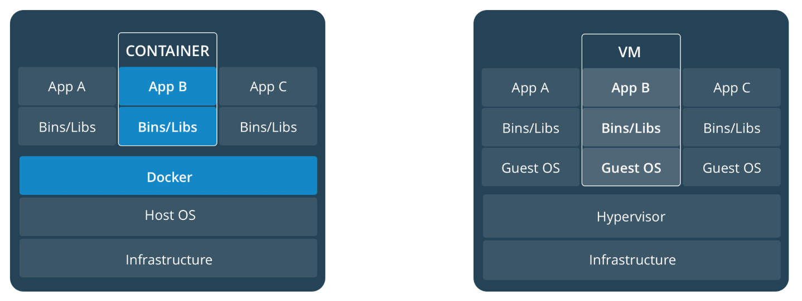

# 手把手帶你學 Docker

Before we get started... 

1. Run `docker --version` and `docker-compose --version` to ensure that you have installed Docker:

	```sh
	docker --version
	Docker version 18.03.1-ce, build 9ee9f40
	
	docker-compose --version	
	docker-compose version 1.21.1, build 5a3f1a3
	```

	- [Install Docker](https://docs.docker.com/install/)
	- [Install Docker Compose](https://docs.docker.com/compose/install/)

2. Get images

	```sh
	docker pull softleader/tomcat85
	docker pull softleader/cli
	docker pull softleader/docker
	```
	
	
	
	> 如果 Docker for Windows 發生無法 pull 情況, 將 DNS Server fix 成 8.8.8.8 後再試一次

## Orientation


> [https://www.youtube.com/watch?v=4ht22ReBjno](https://www.youtube.com/watch?v=4ht22ReBjno)

### Containers and VMs



> [https://docs.docker.com/get-started/#containers-and-virtual-machines](https://docs.docker.com/get-started/#containers-and-virtual-machines)

### General concept


> [https://cultivatehq.com/posts/docker/](https://cultivatehq.com/posts/docker/)

## Image

### Define a container with `Dockerfile`

```
FROM softleader/tomcat85

RUN mkdir -p ${TOMCAT_HOME}/webapps/ROOT
RUN echo "Hello Container!" > ${TOMCAT_HOME}/webapps/ROOT/index.html

CMD $TOMCAT_HOME/bin/catalina.sh run
```

> to see what's in [softleader/tomcat85](https://github.com/softleader/dockerfile/blob/master/tomcat85/Dockerfile)

### Build `Dockerfile` to image

```sh
# build to docker image
docker build -t mytomcat .

# let's take a deep look about layers of image
docker image inspect mytomcat
```

#### Images and layers


> [https://docs.docker.com/storage/storagedriver/#images-and-layers](https://docs.docker.com/storage/storagedriver/#images-and-layers)

#### Make some changes in `Dockerfile`

```
FROM softleader/tomcat85

RUN mkdir -p ${TOMCAT_HOME}/webapps/ROOT \
	&& echo "Hello Container!" > ${TOMCAT_HOME}/webapps/ROOT/index.html

CMD $TOMCAT_HOME/bin/catalina.sh run
```

then rebuild image and inspect again...

```sh
docker build -t mytomcat .

docker image inspect mytomcat
```

#### `Dockerfile` 常用指令

- `FROM` - base image
- `COPY` - 複製當前目錄中的檔案到 container 中
- `ENV` - 宣告變數
- `VOLUME` - 宣告目錄
- `WORKDIR` - 設定當前目錄
- `RUN` - build layer 中執行的指令
- `CMD` - container 啟動時執行的指令

> [https://docs.docker.com/engine/reference/builder/](https://docs.docker.com/engine/reference/builder/)

### Quiz 1

Docker build 的時候才將 `index.html` 包進去


## Container
 
### Networking

```sh
# Start the container in background
docker run -d --publish-all mytomcat

# List currently running docker containers
docker ps

# Connect to tomcat inside the container
curl localhost:$publishe_port

# Stop the container
docker stop $container_id
```

| Flag value	| Description |
|------------|--------------|
| `-p 8080:80` |	Map TCP port 80 in the container to port 8080 on the Docker host. |
| `-p 192.168.1.100:8080:80` |	Map TCP port 80 in the container to port 8080 on the Docker host for connections to host IP 192.168.1.100. |
| `-p 8080:80/udp` |	Map UDP port 80 in the container to port 8080 on the Docker host.|
`-p 8080:80/tcp -p 8080:80/udp` |	Map TCP port 80 in the container to TCP port 8080 on the Docker host, and map UDP port 80 in the container to UDP port 8080 on the Docker host.

> [https://docs.docker.com/config/containers/container-networking/](https://docs.docker.com/config/containers/container-networking/)

```sh
docker run -d -p 8081:8080 mytomcat

docker ps

curl localhost:8081
```

### Storage


> [https://docs.docker.com/storage/](https://docs.docker.com/storage/)

```sh
# Start the container in background, $(pwd) 取代成當前的目錄
docker run -d -p 8081:8080 -v "$(pwd)":/logs mytomcat
docker run -d -p 8081:8080 -v "/d/docker":/logs mytomcat
```

檢查當前目錄:

```sh
.
├── catalina.2018-06-26.log
├── host-manager.2018-06-26.log
├── localhost.2018-06-26.log
├── localhost_access_log..2018-06-26.txt
└── manager.2018-06-26.log
```

### 常用指令

```sh
# List currently running docker containers
docker ps

# List all docker containers (running and stopped)
docker ps -a

# Start a container from an image
docker run -it <IMAGE>

# Start a container
docker start <CONTAINER>

# Stop a container
docker stop <CONTAINER>

# Remove a stopped container
docker rm <CONTAINER>

# Fetch and follow the logs of a container
docker logs -f <CONTAINER>

# Get a shell inside of a container
docker exec -it <CONTAINER> bash
```

### Quiz 2

直接將 `index.html` mount 出來讓工程師可以直接修改吧!

## Docker Compose


### Define services in a Compose file

Create a file called `docker-compose.yml` and paste the following:

```
version: '3'
services:
  mytomcat:
    image: mytomcat
    ports:
     - "8081:8080"
    volumes:
     - .:/logs
```

> [https://docs.docker.com/compose/gettingstarted/](https://docs.docker.com/compose/gettingstarted/)

### Start services with Compose

```sh
# Create and start all containers in the background
docker-compose up -d

# Connect to tomcat inside the container
curl localhost:8081
```

### 常用指令:

```sh
# Create and start all containers in the background
docker-compose up -d

# Stop all running containers
docker-compose stop

# Stop and remove all containers, networks, images, and volumes
docker-compose down

# Follow logs for all containers
docker-compose logs --follow
```

### Quiz 3

將 `index.html` mount 出來的版本也改成 compose 吧

## How docker changes the way we develop

### No more installations

```sh
docker run --rm -d -p 6379:6379 redis
```

> [Redis Docker Hub](https://hub.docker.com/_/redis/)

```sh
docker run -e 'ACCEPT_EULA=Y' -e 'SA_PASSWORD=<YourStrong!Passw0rd>' \
   -p 1433:1433 --name sql1 \
   -d microsoft/mssql-server-linux:2017-latest
```

> [Run the SQL Server 2017 container image with Docker](https://docs.microsoft.com/en-us/sql/linux/quickstart-install-connect-docker?view=sql-server-linux-2017)


```sh
docker run -d postgres
```

> [Postgres Docker Hub](https://hub.docker.com/_/postgres/)

### Cross-platform commands!

- ldapsearch

```
docker run -it --rm \
    -e HOST=softleader.com.tw \
    -e PORT=10388 \
    softleader/ldap-client search dc=softleader,dc=example,dc=com
```

- [curl](https://curl.haxx.se/download.html) + [jq](https://github.com/stedolan/jq)

```sh
docker run -t --rm softleader/curl-jq \
  "-sS https://icp.softleader.com.tw/eureka-jasmine-uat/registry | jq .application "
```

## Congratulations

你已經學會了基本款的 docker 應用了, 期待之後的 [Kubernetes Tutorials](https://kubernetes.io/docs/tutorials/) 吧!

- [返回第一頁](./README.md)

### References

- SoftLeader Docker Hub - [https://hub.docker.com/u/softleader/](https://hub.docker.com/u/softleader/)
- softleader/dockerfile - [https://github.com/softleader/dockerfile](https://github.com/softleader/dockerfile)
- 開發人員必須知道的 Kubernetes 核心技術 - [https://www.slideshare.net/WillHuangTW/things-to-know-about-kubernetes-for-developers/WillHuangTW/things-to-know-about-kubernetes-for-developers](https://www.slideshare.net/WillHuangTW/things-to-know-about-kubernetes-for-developers/WillHuangTW/things-to-know-about-kubernetes-for-developers)
- Docker Official Getting Started Guide - [https://docs.docker.com/get-started/](https://docs.docker.com/get-started/)

