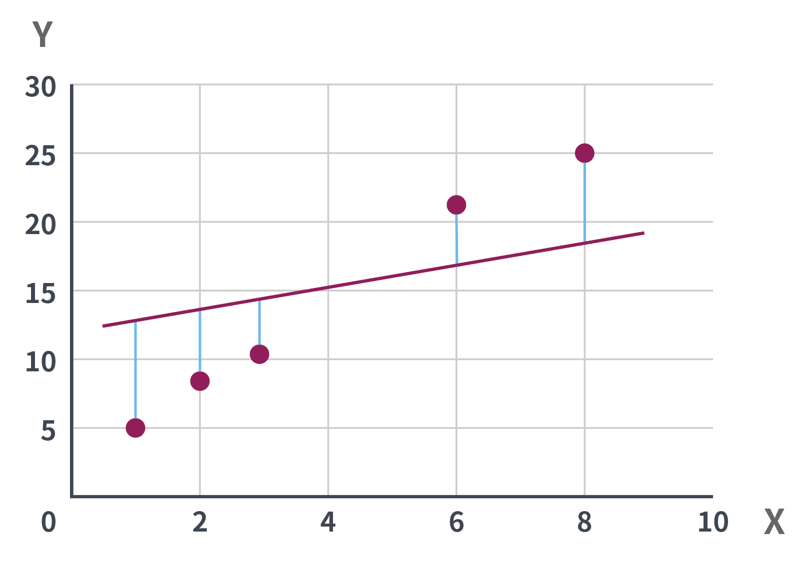
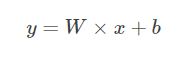
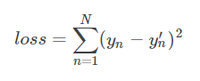
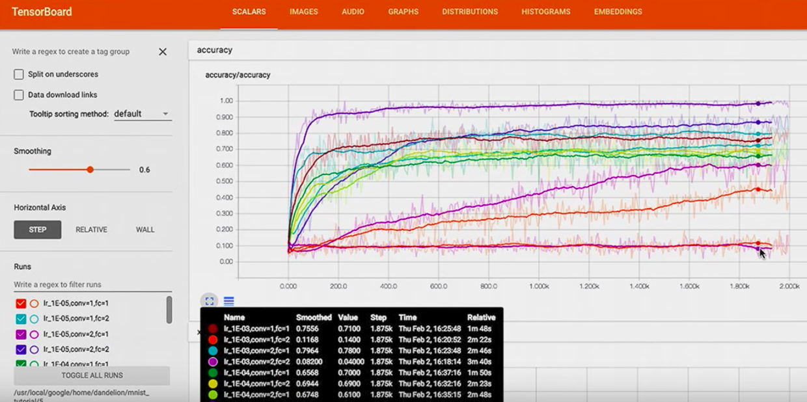

# Getting Started with TensorFlow

## Install by Python

### Download [Python](https://www.python.org/)

- Version: 3.6.6
- 安裝時請記得勾選自動設定環境變數

### Install Tensorflow

#### CPU version

```cmd
pip install tensorflow
```

#### GPU version

```cmd
pip install tensorflow-gpu
```

- GPU 版尚需安裝 NVIDIA CUDA & CUDNN，安裝的版本需視安裝的 tensorflow 版本來決定
- CUDA 介紹: https://developer.nvidia.com/cuda-toolkit
- CUDA 9.0 下載: https://developer.nvidia.com/cuda-90-download-archive?target_os=Windows&target_arch=x86_64&target_version=10&target_type=exenetwork
- CUDNN for CUDA 9.0: https://developer.nvidia.com/rdp/cudnn-download
    - 先安裝 CUDA，再下載 CUDNN 解壓縮後放至 C:\Program Files\NVIDIA GPU Computing Toolkit\CUDA\v9.0\ 下即可

> 若無法執行 pip 代表環境變數未設定，至 path 新增以下路徑即可  
 PYTHONPATH={user_home}\AppData\Local\Programs\Python\Python36  
 Path=%PYTHONPATH%;%PYTHONPATH%\Scripts

### Verify the install

```cmd
python -c "import tensorflow as tf; print(tf.__version__)"
```

### Run python file

```
cd C:\github\softleader-training-course\2018\Q3\tensorflow
python tutorial.py
```

## Install by Docker

### Download [Docker](https://www.docker.com/)

### Install Tensorflow

#### CPU version

```cmd
docker pull tensorflow/tensorflow
```

#### GPU version(Only available for Linux)

https://www.tensorflow.org/install/docker

### Verify the install

```cmd
docker run -it --rm tensorflow/tensorflow python -c "import tensorflow as tf; print(tf.__version__)"
```

### Run host machine python file(路徑請修改成自己專案的位置)

```cmd
docker run -it --rm -v C:\github\softleader-training-course\2018\Q3\tensorflow:/tmp -w /tmp tensorflow/tensorflow python ./tutorial.py
```

## What is Tensorflow ?

Tensorflow 是由 Google 所開發的深度學習與機器學習框架，於2015年11月9日正式開源，以加速機器學習的進展

## What is Tensor ?

3  
[1., 2., 3.]  
[[1., 2., 3.], [4., 5., 6.]]  
[[[1., 2., 3.]], [[7., 8., 9.]]]

## constant

```python
tf.constant(3.2)
```

## placeholder

```python
tf.placeholder(dtype=tf.float32)
```

## Variable

```
tf.Variable([.1], dtype=tf.float32)
```

## Session

TensorFlow 使用 Data Flow Graphs(資料流圖) 將計算表示為獨立的指令之間的依賴關係，之後透過 Session 啟動整個運算，最大優點為可以並行處理

  

## 線性回歸模型

  
  


## Gradient Descent(梯度下降)

```python
tf.train.GradientDescentOptimizer()
```

## Run Tensorboard

```cmd
tensorboard --logdir=<圖檔位置>
```

