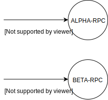
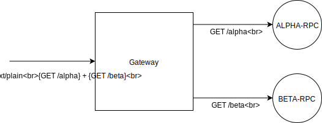

# 基礎環境與架構

https://start.spring.io/

## Services
1. RPC
    - meta:
        - alpha-rpc:
            - group: tw.com.softleader.demo.ms
            - artifact: alpha-rpc
        - beta-rpc:
            - group: tw.com.softleader.demo.ms
            - artifact: beta-rpc
    - dependency:
        - required: `web` `eureka-discovery` `actuator` `feign`
        - optional: `lombok` `devtool`
    - properties:
        ```properties
        # boostrap.properties (boostrap.yml)
        spring.application.name=alpha-rpc

        # application.properties (application.yml)
        # alpha.port=10001, beta.port=10002
        server.port=10001
        eureka.client.enabled=false
        ```
        > 還沒開始串MS, 所以先把eureka停掉
        > - 參考資料
        >   1. [SpringCloud官方文件](https://cloud.spring.io/spring-cloud-commons/multi/multi__spring_cloud_context_application_context_services.html#_the_bootstrap_application_context)
        >   2. [boostrap.yml vs application.yml](https://hk.saowen.com/a/3bba1a89981b5f3d2c4f463e913e41c4397267bf80dfe61eafaaa9f184e2e273)
    - 實作:

        
        > 建立兩個 rpc 各自提供一個 restful api, 回傳 service name 與 ip

2. Gateway
    - meta:
        - group: tw.com.softleader.demo.ms
        - arifact: gateway
    - dependency:
        - required: `web` `eureka-discovery` `actuator` `feign`
        - optional: `lombok` `devtool`
    - properties:
        ```properties
        # boostrap.properties (boostrap.yml)
        spring.application.name=gateway

        # application.properties (application.yml)
        server.port=8080
        eureka.client.enabled=false
        ```
        > 還沒開始串MS, 所以先把eureka停掉
    - java
        ```java
        @EnableFeignClients
        @SpringBootApplication
        public class GatewayApplication {
        ```
    - 實作:

        
        > 建立 gateway, 並實作一個 restful 介面 `GET /call` 回傳呼叫兩個 rpc 的結果
    - Stub:
        ```java
        @FeignClient(name = "alpha-rpc", url = "localhost:10001")
        public interface AlphaRpcStub {
        ```
        > name 對應到呼叫服務的 `spring.application.name`
        > url 則是在 eureka 介入前 feign 直接呼叫對應 api 的方法

3. Eureka Server
    - meta
        - group: tw.com.softleader.demo.ms
        - arifact: eureka
    - dependency:
        - required: `eureka-server` `actuator`
    - properties
        - eureka
            ```properties
            # boostrap.properties (boostrap.yml)
            spring.application.name=eureka

            # application.properties (application.yml)
            server.port=10000

            eureka.client.serviceUrl.defaultZone=http://localhost:10000/eureka/
            eureka.client.fetch-registry=false
            eureka.client.register-with-eureka=false
            eureka.instance.preferIpAddress=true
            eureka.server.enableSelfPreservation=false
            ```
            > eureka 預設也會進行自我註冊, 由於目前環境 eureka 沒有 cluster 的需求, 因此停用這塊
        - gateway, rpc
            ```properties
            eureka.client.enabled=true
            eureka.client.serviceUrl.defaultZone=http://localhost:10000/eureka/
            ```
            > 加入 eureka 後, 將 eureka.clien 啟動, 且 stub 於 @FeignClient 宣告的 url 也可以拔了

## Dockerize
- Dockerfile
    ```Dockerfile
    FROM softleader/openjdk11
    COPY ./target/app.jar /app.jar
    ENV JAVA_OPTS=""
    ENV SPRING_PROFILES_ACTIVE="docker"
    ENTRYPOINT ["/bin/sh", "-c", "java $JAVA_OPTS -Dspring.profiles.active=$SPRING_PROFILES_ACTIVE -Djava.security.egd=file:/dev/./urandom -jar /app.jar"]
    ```
    > 1. 使用 JDK11 的 image
    > 2. 將包好的 app.jar 複製到 image 內
    > 3. 設定 JAVA_OPTS 變數, 使後續建立 container 時, 可以由啟動參數來自定義 JVM 環境變數
    > 4. 設定 SPRING_PROFILES_ACTIVE 變數, 使後續建立 container 時, 可以由啟動參數來自定義 Spring Profile
    > 5. 設定 container 啟動時呼叫的指令

- root pom.xml
    - 使 maven build 可以一次 build 所有 app
    ```xml
    <?xml version="1.0" encoding="UTF-8"?>
    <project xmlns="http://maven.apache.org/POM/4.0.0" xmlns:xsi="http://www.w3.org/2001/XMLSchema-instance"
             xsi:schemaLocation="http://maven.apache.org/POM/4.0.0 http://maven.apache.org/xsd/maven-4.0.0.xsd">
        <modelVersion>4.0.0</modelVersion>

        <groupId>tw.com.softleader.demo.ms</groupId>
        <artifactId>root</artifactId>
        <version>0.0.1-SNAPSHOT</version>
        <packaging>pom</packaging>

        <modules>
            <module>gateway</module>
            <module>eureka</module>
            <module>alpha-rpc</module>
            <module>beta-rpc</module>
        </modules>
    </project>
    ```

- app pom.xml
    - 使 build 出來的 jar 統一叫做 app.jar
    ```
    <project>
        ...
        <build>
            ...
            <finalName>app</finalName>
        </build>
    </project>
    ```

- application-docker.properties
    - 轉換為 docker 環境後, Host的設定將會有所不同, 利用 spring-profiles 切換
    ```properties
    server.port=8080
    eureka.client.serviceUrl.defaultZone=http://eureka:10000/eureka/
    ```

- docker-compose.yml
    - 透過 docker compose 控制多個 image
    ```
    version: '3.1'

    services:
      eureka:
        build: ./eureka
        ports:
          - 10000:10000
      alpha-rpc:
        build: ./alpha-rpc
      beta-rpc:
        build: ./beta-rpc
      gateway:
        build: ./gateway
        ports:
          - 8080:8080
    ```
