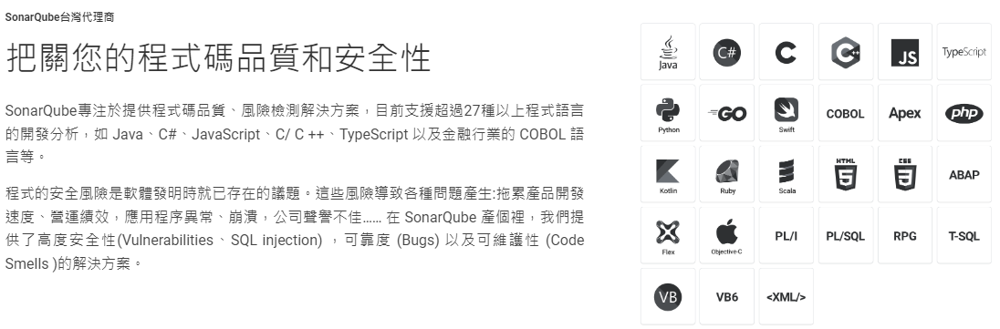
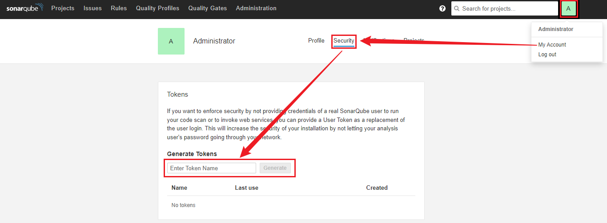
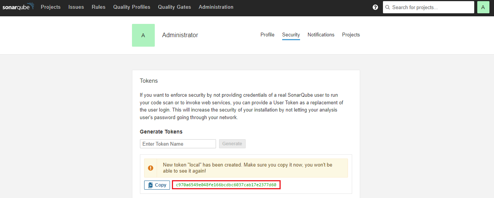
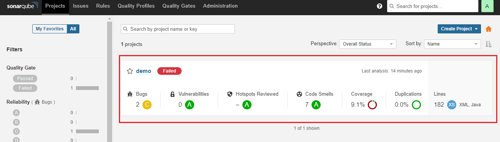
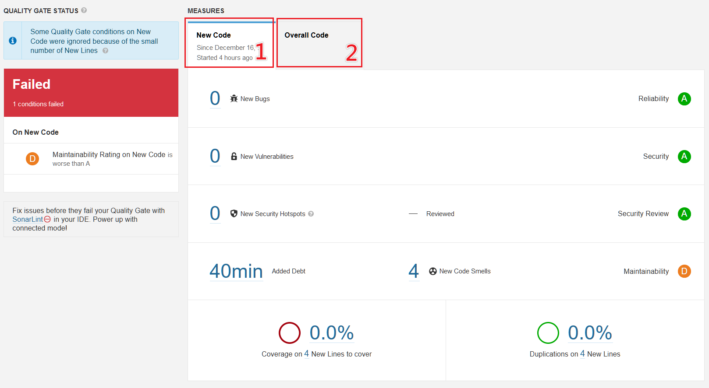
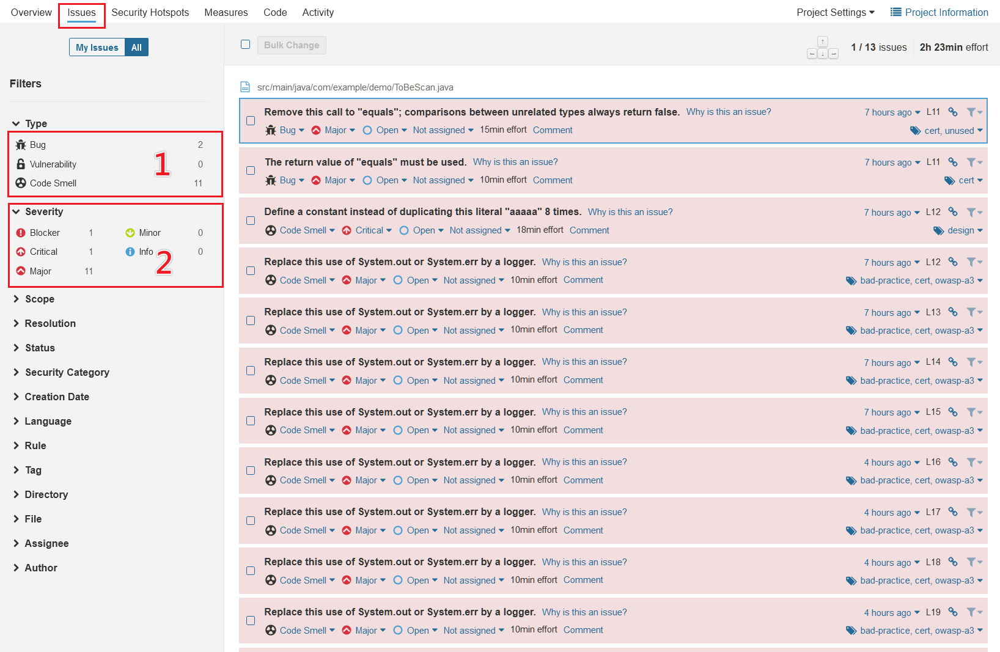
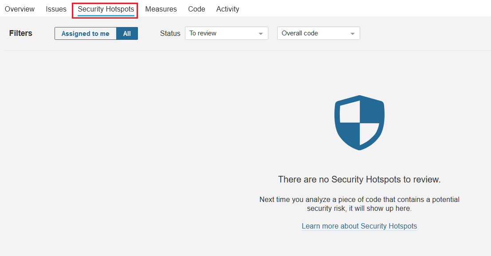

# 我要怎麼寫好我的Code?

A: 要有人跟你講你的Code不好在哪

Q:大家都沒空怎辦?

A: 隆重推薦 >> **SonarQube** <<

## 啥是 SonarQube

> 以上資訊取自 SonarQube台灣代理商: [聚達資服](https://www.extremedata.com.tw/sonarqube/)

## 部屬 SonarQube(社群版)
### 前置作業 (SonarQube內嵌一個Elasticsearch, 需要修改max_map_count)
```shell
# Windows才需下此行
wsl -d docker-desktop

# 修改當前環境
sysctl -w vm.max_map_count=262144

# 修改使重開機後依然能生效
vi /etc/sysctl.conf
# 於該文檔內容加入下行
vm.max_map_count=262144
```

### 啟動 SonarQube
```shell
# 都幫你寫好了, 用docker就能啟動!
docker-compose up -d

# 啟動後位於 http://localhost:9000/
# 預設帳號與密碼皆為 admin
# 初次登入後會要求修改密碼
```

## 專案套用 SonarQube

### 調整 pom.xml
```xml
...
<properties>
   ...
   <dependency-check-maven.version>5.2.4</dependency-check-maven.version>
   <jacoco-maven-plugin.version>0.8.7</jacoco-maven-plugin.version>
   <sonar-maven-plugin.version>3.9.1.2184</sonar-maven-plugin.version>
   <sonar.java.coveragePlugin>jacoco</sonar.java.coveragePlugin>
   <sonar.dynamicAnalysis>reuseReports</sonar.dynamicAnalysis>
   <sonar.exclusions>
      **/target/**,**/*.jsp,
      **/DemoApplication.java
   </sonar.exclusions>
   <sonar.coverage.exclusions>
      **/*Application*,
      **/*Exception*,
      **/*Utils*,
      **/*Aspect*,
      **/*Config*,
      **/exception/**,
      **/config/**,
      **/jpa/**,
      **/http/**,
      **/enums/**,
      **/mapper/**,
      **/job/**
   </sonar.coverage.exclusions>
</properties>
```
> `sonar.exclusions`: 源碼掃描排除項目, `sonar.coverage.exclusions`: 覆蓋率檢查排除項目  
> `**` 表任意層數目錄, `*` 表任意字串

```xml
<build>
   <plugins>
      ...
      <plugin>
        <groupId>net.revelc.code.formatter</groupId>
        <artifactId>formatter-maven-plugin</artifactId>
        <executions>
          <execution>
            <phase>process-sources</phase>
            <goals>
              <goal>format</goal>
              <goal>validate</goal>
            </goals>
          </execution>
        </executions>
      </plugin>
      <plugin>
        <groupId>org.owasp</groupId>
        <artifactId>dependency-check-maven</artifactId>
        <version>${dependency-check-maven.version}</version>
      </plugin>
      <plugin>
        <groupId>org.jacoco</groupId>
        <artifactId>jacoco-maven-plugin</artifactId>
        <version>${jacoco-maven-plugin.version}</version>
        <configuration>
          <skip>${maven.test.skip}</skip>
          <destFile>${sonar.jacoco.reportPath}</destFile>
          <append>true</append>
        </configuration>
        <executions>
          <execution>
            <id>jacoco-initialize</id>
            <goals>
              <goal>prepare-agent</goal>
            </goals>
          </execution>
          <execution>
            <id>default-prepare-agent</id>
            <goals>
              <goal>prepare-agent</goal>
            </goals>
          </execution>
          <execution>
            <id>default-report</id>
            <phase>test</phase>
            <goals>
              <goal>report</goal>
            </goals>
          </execution>
          <execution>
            <id>jacoco-site</id>
            <phase>package</phase>
            <goals>
              <goal>report</goal>
            </goals>
          </execution>
        </executions>
      </plugin>
      <plugin>
        <groupId>org.sonarsource.scanner.maven</groupId>
        <artifactId>sonar-maven-plugin</artifactId>
        <version>${sonar-maven-plugin.version}</version>
        <dependencies>
          <dependency>
            <groupId>javax.servlet</groupId>
            <artifactId>javax.servlet-api</artifactId>
            <version>4.0.1</version>
          </dependency>
        </dependencies>
      </plugin>
   </plugins>
</build>
```
> 這一套 Plugins 包含了程式碼自動排版+覆蓋率測試+Sonar串接

### 產生 Sonar Token



### 執行 maven build
```shell
mvn -Psonar -e clean package sonar:sonar -Dsonar.host.url=http://localhost:9000/ -Dsonar.login=<token>

# window cmd/powershell 執行時, 會需要將特定字串補上雙引號 ex:
 mvn -Psonar -e clean package sonar:sonar -D"sonar.host.url=http://localhost:9000/" -D"sonar.login=8945b6d46f324037e029eb35256cd7c212b2b136"
```

## 查看 SonarQube 報告


### List
1. 專案
   > maven build 成功後會自動建立, 社群版沒有切分branch功能
2. 狀態 `Pass`/`Failed`
   > 依據程式碼是否有重大問題、覆蓋率、重複行數等進行判定
3. Bugs 
4. Vulnerabilities(弱點)
5. Hotspots Reviewed(安控點檢視)
6. Code Smells(程式碼異味)
7. 測試碼覆蓋率
8. 程式碼重複率


### Overview

1. 新增加程式碼
2. 全部程式碼

### Issue

1. 大分類
   > 建議Bug與Vulnerability(弱點)這兩類的所有問題全部要進行修正  
   > 這兩類主要是已經存在程式邏輯問題或者是易被利用的弱點  
   > Code Smell屬於還沒有造成問題，但屬於會逐漸累積成技術債的程式碼  
   > 建議至少處理小分類中的 Blocker/Critical/Major三項
2. 小分類
   > 在大分類下，又依據嚴重等級區分的項目，一定程度可以用來判斷需解決的急迫程度

### Security Hotspots

- 安控熱點: 屬於架構類應被關注的安全弱點項目，應全部檢視並處理之

## 結合CICD
- 以法巴為例: https://github.com/softleader/cardif-ifrs17/blob/master/Jenkinsfile
   1. 只於 master 中處理 sonar (節省分支包版時間, 避免分支報告覆蓋 master)
   2. 透過 sonar 產生源碼掃描報告, 提供SIT測試證明
   
- 公司通用Sonar: http://softleader.com.tw:39000/
   - 需透過oidc進行登入，若尚未使用過公司任何需以oidc登入的服務，初次登入需要聯繫RD進行帳號授權開通