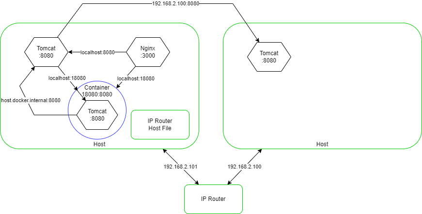

# 我該如何Call到Pod (K8S的Servcie運用案例說明)

- 錄影檔: 待補

各種不同地方的App互相呼叫

- 在Local部屬一個Nignx: [docker-compose.yaml](docker-compose.yaml)

- K8S第一個Nginx: [nginx.yaml](nginx.yaml)
- K8S第二個Nginx: [nginx-2nd.yaml](nginx-2nd.yaml)

- 延伸閱讀: [原理解說](https://godleon.github.io/blog/Kubernetes/k8s-Service-Overview/)