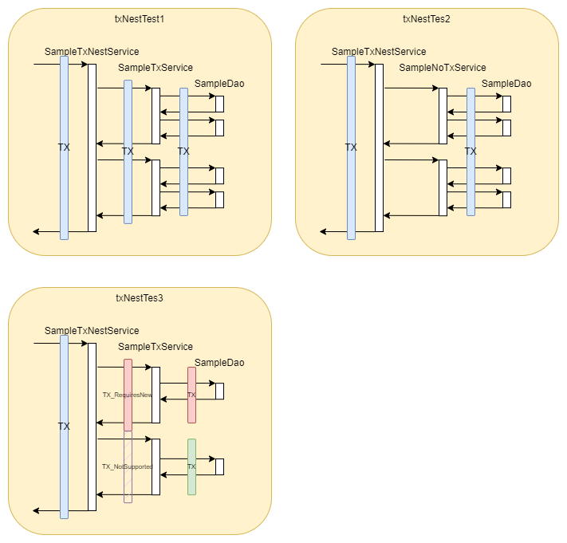

# 講解 Spring Transaction 適用情境與運作原理

錄影檔: 待補

## Demos

[`com.example.demo.DemoApplicationTests`](./src/test/java/com/example/demo/DemoApplicationTests.java)



```
org.springframework.transaction.annotation.Propagation 是 Spring Framework 中的一個枚舉（enum），用於指定事務的傳播行為。這些枚舉常用於標註在方法上，以指定事務的行為。以下是 Propagation 中的一些項目及其作用：

REQUIRED:

如果當前存在事務，則加入該事務；如果不存在，則創建一個新的事務。
SUPPORTS:

如果當前存在事務，則加入該事務；如果不存在，則以非事務方式執行。
MANDATORY:

要求當前存在事務，否則拋出異常（IllegalTransactionStateException）。
REQUIRES_NEW:

總是創建一個新的事務。如果當前存在事務，則將其掛起。
NOT_SUPPORTED:

以非事務方式執行，並且如果當前存在事務，則將其掛起。
NEVER:

以非事務方式執行，並且如果當前存在事務，則拋出異常（IllegalTransactionStateException）。
NESTED:

如果當前存在事務，則在內部創建一個嵌套事務（可以有多個保存點），如果不存在，則創建一個新的事務。
這些選項用於指定當前方法被調用時，事務管理器應該如何處理事務。不同的傳播行為適用於不同的應用場景，並允許開發人員細粒度地控制事務的行為。
```