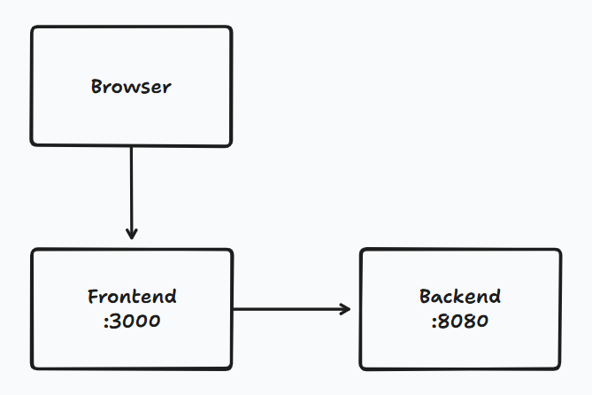

# 前後端資料交換

[錄影檔](https://drive.google.com/file/d/1CirhKX51Rg-4RBqkfucGUCQGPkXkGMEF/view?usp=drive_link)

## [demo-backend](demo-backend)
- java 21
- run `mvn spring-boot:run`

## [demo-frontend](demo-frontend)
- node 18
- package manager: [pnpm](https://pnpm.io/zh-TW/installation)(should be installed before init project)
- run `pnpm install` for init project
- run `pnpm run dev`

## 架構: 前後分離+反向代理
