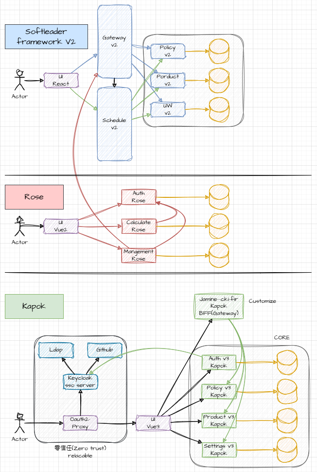

# 講講公司的各種專案架構

[錄影檔](https://drive.google.com/file/d/1gD7cIzD7_yvAhRRG4qbU7mKbQcbY_-WE/view?usp=drive_link)

## Softleader Framework v2
- Spring Framework(3 or 4?) 開始架構
- 目前更新到 Spring Boot 1
- 限定 jdk8
- 最初設計給單體式服務 -> 轉型成為微服務
- 未來需要升級, 或重新開發, 改包成war -> tomcat v9

### 專案
- Jasmine v2.5, v2.6(兆豐)
- Gardenia(第一金)
- 請假系統

## ROSE (v2+)
- Spring Boot 2
- 微服務原生
- jdk 11

### 專案
- 再保 v3
- 初期 IFRS17 Prject

## Kapok (v3)
- Spring Boot 2 -> Spring Boot 3
- 第一個成功做到大版本升級的 FW
- 雲原生(K8S)

### 專案
- 全球 (客製化版本 -> 轉為Kapok)
- Jasmine v3 (兆豐Fir, 中信Cas)
- iris v3(兆豐)
- B2B v3 (華南旅責)

