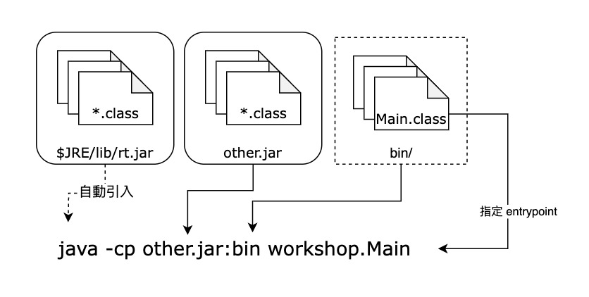

# Java Platform Module System (JPMS)

- [JSR 376](https://openjdk.org/projects/jigsaw/spec/), 於 Java 9 以後可用

- 在 Java 9 之前

   

- 在 Java 9 之後

   

## Quickstart

+ Create and Run Module

   建立名稱 `workshop` 的資料夾, 並在其中建立子資料夾 `app`, 目錄結構如下:

   ```bash
   workshop
   └── app
       └── src
           ├── module-info.java
           └── myapp
               └── Main.java
   ```

   `app/src/module-info.java` 的內容如下:

   ```java
   module workshop.app {
     requires java.logging;
   }
   ```

   `app/src/myapp/Main.java` 的內容如下:

   ```java
   package myapp;
   
   import java.util.logging.Logger;
   
   public class Main {
   
     private static final Logger log = Logger.getLogger(Main.class.getName());
   
     public static void main(String[] args) {
       log.info("Hello, World!");
     }
   }
   ```

   於 `app` 目錄, 執行以下指令進行編譯:

   ```bash
   javac -d bin src/module-info.java src/myapp/*
   ```

   執行以下指令啟動應用程式:

   ```bash
   java --module-path bin --module workshop.app/myapp.Main
   ```

+ Build Module Jar

   於 `app` 目錄, 執行以下指令將模組打包為 `JAR` 檔案

   ```bash
   jar -c -f app.jar -e myapp.Main -C bin .
   ```

   一般模式執行:

   ```bash
   java -jar app.jar
   ```

   Module 模式執行:

   ```bash
   java --module-path app.jar --module workshop.app
   ```

+ Build Java Runtime

   我們還可以進一步將模組 JAR 封裝成 Java runtime, 於 `app` 目錄, 執行以下指令建立 jmod

   ```bash
   jmod create --class-path app.jar app.jmod
   ```

   產出 Java runtime:

   ```bash
   jlink --module-path app.jmod --add-modules workshop.app --output runtime
   ```

   啟動應用程式:

   ```bash
   runtime/bin/java --module workshop.app
   ```

## Module Declarations

`module-info` 檔案是模組化的核心, 支援的[語法](https://docs.oracle.com/javase/specs/jls/se16/html/jls-7.html#jls-7.7)如下:

```java
[open] module <ModuleName> {
  requires [transitive|static] <ModuleName>;
  exports <PackageName> [to <ModuleName> [, <ModuleName>, ...]];
  opens <PackageName> [to <ModuleName> [, <ModuleName>, ...]];
  uses <TypeName>;
  provides <TypeName> with <TypeName> [, <TypeName>, ...];
}
```

[關鍵字](https://www.oracle.com/tw/corporate/features/understanding-java-9-modules.html)說明:

- `[open] module <ModuleName>`: 宣告模組, 名稱不可重複

   - `open`: 允許模組內所有 package 在執行時被 reflection 存取 (不包含編譯), 無需額外宣告 `opens`

- `requires <ModuleName>`: 指定相依模組, 若 A requires B 即 A 讀取 B, 或 B 被 A 讀取

   - `transitive` 傳遞相依性, 例如: A → B 且 B requires transitive C, 則 A → C

   - `static`: 只在編譯時相依

- `exports <PackageName>`: 指定編譯時可存取的 package, 包含運行時 reflection 的存取

   - `to`: 限定允許存取的模組

- `open <PackageName>`: 指定運行時 reflection 可存取的 package (不包含編譯)

   - `to`: 限定允許存取的模組

- `uses <TypeName>`: 指定模組所使用的服務, 服務是抽象的 interface 或 abstract class, 例如: `java.sql.Driver`

- `provide <TypeName> with <TypeName>`: 指定模組提供的服務實作, 例如: `oracle.jdbc.driver.OracleDriver`

## Backward Compatibility

- 模組化是向下相容的, 固 Java 9 之前跟之後的程式碼是可以混合使用的
- 啟動時, 透過指定 Module Path 或 Class Path 來決定載入的策略

| | Command line | Modular JAR | Regular/Plain JAR |
|--|--|--|--|
| Module Path | `-p`, `--module-path` | Explicit Module | Automatic Module |
| Class Path | `-cp`, `-classpath`, `—-class-path` | Unnamed Module | Unnamed Module |

- Unnamed Module
   - Has no names   
   - Can read all modules
   - Exports all packages
- Automatic Modules
   - Named by manifest entry `Automatic-Module-Name` or jar name
   - Can read all modules

   - Exports all packages

## Quiz

於 `workshop` 資料夾中, 建立 `lib` 資料夾

```bash
workshop
├── app
│   └── src
│       ├── module-info.java
│       └── myapp
│           └── Main.java
└── lib
    └── src
        ├── module-info.java
        └── mylib
            └── Greeting.java
```

+ 接著, 連同 `app` 資料夾內的檔案, 將結構及檔案內容進行調整

   `app/src/module-info.java` 的內容如下:

   ```java
   module workshop.app {
     requires workshop.lib;
   }
   ```

   `app/src/myapp/Main.java` 的內容如下:

   ```java
   package myapp;
   
   import mylib.Greeting;
   
   public class Main {
   
     public static void main(String[] args) {
       new Greeting().hello();
     }
   }
   
   ```

   `lib/src/module-info.java` 的內容如下:

   ```java
   module workshop.lib {
     requires java.logging;
     exports mylib;
   }
   ```

   `lib/src/mylib/Greeting.java` 的內容如下:

   ```java
   package mylib;
   
   import java.util.logging.Logger;
   
   public class Greeting {
   
     private static final Logger log = Logger.getLogger(Greeting.class.getName());
   
     public void hello() {
       log.info("Hello, World!");
     }
   }
   
   ```

1. 將 `lib` 打包成 `greeting.jar`

2. 將 `app` 打包成 `app.jar`

3. 執行 `app.jar`

## Takeaway

- 更明確的依賴宣告:

   - package (image) 也可以更小化

- export 更精準: 

   - internal package 可以不用被釋出, 以避免誤用

   - export to 更精準

- 精確的 Load Services 

- module 跟非 module 可以並行


