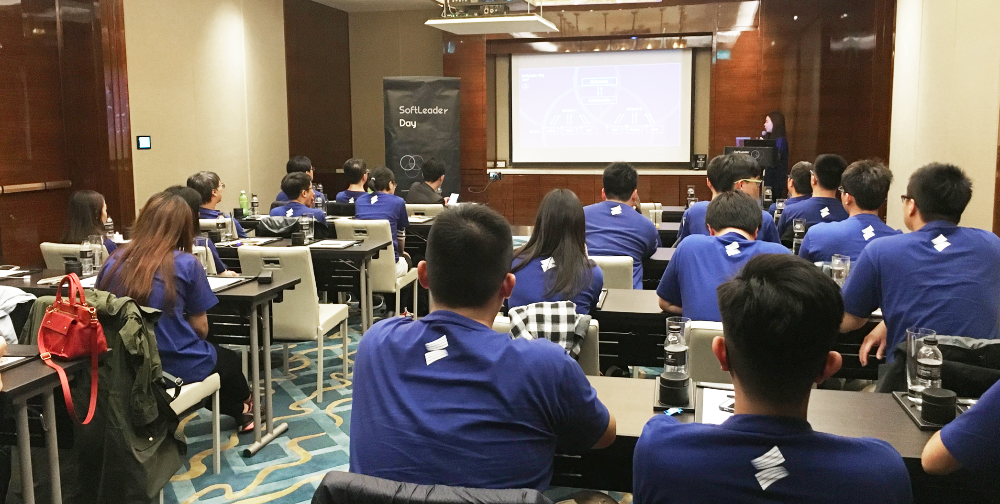

[](https://travis-ci.org/softleader/softleader-training-course)
[](https://GitHub.com/softleader/softleader-training-course/graphs/commit-activity)
[](http://makeapullrequest.com)

# 松凌科技教育訓練專區

[http://bit.ly/softleader-training-course](http://bit.ly/softleader-training-course)




## Directory Structure

請講師將上課教材，依照下述目錄結構擺放, **課程名稱不可以有空白!**

```sh
.
└── <年度>
    └── <季>
        ├── <課程A>
        ├── <課程B>
        └── ...
```

如:

```sh
.
└── 2016
    ├── Q1
    │   ├── spring-transaction
    │   └── stream-and-lambda
    └── Q2
        ├── design-patterns
        └── ...
```

在你的課程目錄中, 如果有放一個 *README.md*, 會自動擷取該檔案中第一個 header (`#`, `##` ... `######`) 作為課程標題

```sh
.
└── <年度>
    └── <季>
        └── <課程A>
             └── README.md
```

## Courses

> Auto-generated by *toc*

#### 2024
- Q1 - [custom-exception](/2024/Q1/custom-exception) - 自定義Excption 啥時有用
- Q1 - [docker-101](/2024/Q1/docker-101) - run docker container
- Q1 - [effective-using-data-jpa](/2024/Q1/effective-using-data-jpa) - 如何高效的使用Spring Data JPA
- Q1 - [efk-usage](/2024/Q1/efk-usage) - 靈活運用EFK平台
- Q1 - [introduce-dockerfile](/2024/Q1/introduce-dockerfile) - 講講公司用過的那些Dcokerfile
- Q1 - [liquibase-introduction](/2024/Q1/liquibase-introduction) - Liquibase 教育訓練
- Q2 - [how-to-goto-xxx_cloud_softleader](/2024/Q2/how-to-goto-xxx_cloud_softleader) - 去xxx.cloud.softleader的路怎麼走
- Q2 - [kapok-security](/2024/Q2/kapok-security) - 聊聊 Spring/Kapok Security
- Q3 - [effective-technique-in-project](/2024/Q3/effective-technique-in-project) - 我在處理大量資料的服務中使用到的一些技巧
- Q3 - [front-back-end-data-transfer](/2024/Q3/front-back-end-data-transfer) - 前後端資料交換
- Q4 - [good-sso-pattern](/2024/Q4/good-sso-pattern) - JCConf 2024 如何不要那麼狼狽的串接各種甲方的SSO
- Q4 - [jcconf-practice](/2024/Q4/jcconf-practice) - Java 專案起手式 (Kyle)
- Q4 - [jcconf-preview](/2024/Q4/jcconf-preview) - 來看看JCConf到底都有啥題目
- Q4 - [start-softleader-project](/2024/Q4/start-softleader-project) - 講講目前我們開新專案會用到的那些Dependencies們

#### 2023
- Q1 - [access-control](/2023/Q1/access-control) - Kapok Security - Access Control
- Q1 - [auto-managed-ingress](/2023/Q1/auto-managed-ingress) - Auto Managed Ingess
- Q1 - [kuztomize-part1](/2023/Q1/kuztomize-part1) - Kustomize: Part 1
- Q1 - [reducing-if-else](/2023/Q1/reducing-if-else) - 如何減少程式內的IF-ELSE
- Q1 - [spring-data](/2023/Q1/spring-data) - Spring Data Jpa
- Q1 - [spring-web](/2023/Q1/spring-web) - 從 Http 開始了解的 Spring Web
- Q1 - [what-is-spring-bean](/2023/Q1/what-is-spring-bean) - 講講Spring Bean與我們Framework的前世今生
- Q2 - [aop](/2023/Q2/aop) - 深入淺出 AOP
- Q2 - [kubernetes-training](/2023/Q2/kubernetes-training) - 認識Kubernetes
- Q2 - [oidc](/2023/Q2/oidc) - 認識 OAuth2/OIDC 及如何使用 Kapok 串接
- Q2 - [oomkilled](/2023/Q2/oomkilled) - 為啥我部署到 Kubernetes 的程式被 OOMKilled 了!?
- Q3 - [js-es6](/2023/Q3/js-es6) - JavaScript  ES6 都出了這麼久了, 這些特性這麼好用你還沒用嗎?
- Q3 - [kubernetes-pv-pvc](/2023/Q3/kubernetes-pv-pvc) - 介紹 Kubernetes PV / PVC
- Q3 - [oop-practice](/2023/Q3/oop-practice) - 物件導向的特性運用
- Q3 - [release-workflow](/2023/Q3/release-workflow) - Release Workflow
- Q3 - [simple-start-a-spring-boot-project](/2023/Q3/simple-start-a-spring-boot-project) - Spring Boot 入門 (Web + Jpa)
- Q3 - [specification-mapper](/2023/Q3/specification-mapper) - Specification Mapper
- Q3 - [vue-component-practice](/2023/Q3/vue-component-practice) - 在Vue寫一個Component有什麼要點
- Q4 - [kubernetes-basic](/2023/Q4/kubernetes-basic) - K8S deployment詳解
- Q4 - [kubernetes-network](/2023/Q4/kubernetes-network) - 我該如何Call到Pod (K8S的Servcie運用案例說明)
- Q4 - [more-effective-coding](/2023/Q4/more-effective-coding) - 如何寫出一個優良的Method
- Q4 - [softleader-cicd](/2023/Q4/softleader-cicd) - 講講公司CICD
- Q4 - [spring-transaction](/2023/Q4/spring-transaction) - 講解 Spring Transaction 適用情境與運作原理
- Q4 - [stream-collect](/2023/Q4/stream-collect) - 深度剖析 java.util.stream.Stream#collect
- Q4 - [what-happens-when-kubectl-apply-deploy](/2023/Q4/what-happens-when-kubectl-apply-deploy) - 執行 `kubectl apply deployment` 後發生了什麼事

#### 2022
- Q1 - [unit-testing](/2022/Q1/unit-testing) - Unit Testing 手把手教學
- Q4 - [deploy-way-at-softleader](/2022/Q4/deploy-way-at-softleader) - 我們公司的主流部屬方式以及其演進
- Q4 - [intellij-idea-introduce](/2022/Q4/intellij-idea-introduce) - Intellij-idea使用技巧
- Q4 - [java-data-tips](/2022/Q4/java-data-tips) - Java處理大量資料或迴圈時的注意點
- Q4 - [k8s-series-1](/2022/Q4/k8s-series-1) - 給只知道Tomcat的人一步步開始了解Docker跟Container
- Q4 - [k8s-series-2](/2022/Q4/k8s-series-2) - 從 docker run 開始到 kubectl apply
- Q4 - [k8s-series-3](/2022/Q4/k8s-series-3) - 如何從SLKE上的資訊了解專案的運作內容
- Q4 - [k8s-series-4](/2022/Q4/k8s-series-4) - Kubernetes deployment 撰寫技巧
- Q4 - [stream](/2022/Q4/stream) - Stream Api的活用

#### 2021
- Q1 - [base-jre-image](/2021/Q1/base-jre-image) - JRE Base Image
- Q1 - [springboot24-config](/2021/Q1/springboot24-config) - Spring Boot 2.4 Externalized Configuration
- Q2 - [java-io](/2021/Q2/java-io) - Java-IO
- Q2 - [react-crud](/2021/Q2/react-crud) - React CURD
- Q2 - [spring-boot-demo](/2021/Q2/spring-boot-demo)
- Q2 - [vue-v2](/2021/Q2/vue-v2) - vue2-training-course
- Q3 - [build-docker-image](/2021/Q3/build-docker-image)
- Q3 - [jdk-api](/2021/Q3/jdk-api) - JDK-API
- Q3 - [softleader-env](/2021/Q3/softleader-env) - 松凌科技專案環境
- Q3 - [spring-boot(jakarta99)](/2021/Q3/spring-boot(jakarta99)) - Spring-boot 學習手冊(by jakarta99)
- Q3 - [spring-web-jpa](/2021/Q3/spring-web-jpa) - Spring-MVC & Spring-Data
- Q4 - [api-design](/2021/Q4/api-design) - API 設計與思考
- Q4 - [maven-structure](/2021/Q4/maven-structure) - Maven
- Q4 - [platform-trubleshoting](/2021/Q4/platform-trubleshoting) - 各環境問題解決心得分享
- Q4 - [react](/2021/Q4/react) - REACT
- Q4 - [regex](/2021/Q4/regex) - 正規表示法技巧
- Q4 - [sonar](/2021/Q4/sonar) - 我要怎麼寫好我的Code?
- Q4 - [spring-data](/2021/Q4/spring-data)
- Q4 - [spring-mvc](/2021/Q4/spring-mvc)
- Q4 - [stream](/2021/Q4/stream) - Stream

#### 2020
- Q1 - [fluent-bit](/2020/Q1/fluent-bit) - Fluent Bit

#### 2019
- Q1 - [microservice](/2019/Q1/microservice) - Microservice workshop
- Q1 - [react-redux](/2019/Q1/react-redux) - Available Scripts
- Q2 - [a-beginners-guide-to-kubernetes](/2019/Q2/a-beginners-guide-to-kubernetes) - A Beginner’s Guide to Kubernetes
- Q4 - [mapstruct](/2019/Q4/mapstruct) - MapStruct - Java bean mappings [WIP]

#### 2018
- Q1 - [ECMAScript6](/2018/Q1/ECMAScript6) - ECMAScript 6
- Q1 - [logging](/2018/Q1/logging)
- Q1 - [softleader-ldap](/2018/Q1/softleader-ldap) - LDAP 基本介紹
- Q1 - [stream-adv](/2018/Q1/stream-adv) - 2018Q1 Stream
- Q2 - [a-h](/2018/Q2/a-h) - A&H
- Q2 - [docker](/2018/Q2/docker) - 手把手帶你學 Docker
- Q2 - [exception-handling](/2018/Q2/exception-handling) - Best practices to handle exceptions
- Q2 - [microservices](/2018/Q2/microservices)
- Q2 - [tensorflow](/2018/Q2/tensorflow)
- Q3 - [Implements-SSO-with-Spring-Session](/2018/Q3/Implements-SSO-with-Spring-Session)
- Q3 - [building-docker-images](/2018/Q3/building-docker-images) - Building Docker Images
- Q3 - [jmeter](/2018/Q3/jmeter) - Jmeter功能介紹
- Q3 - [microservice-with-springcloud](/2018/Q3/microservice-with-springcloud)
- Q3 - [tensorflow](/2018/Q3/tensorflow) - Getting Started with TensorFlow

#### 2017
- Q1 - [redux](/2017/Q1/redux)
- Q1 - [regex](/2017/Q1/regex) - 一上來就是最終Boss關的Regex
- Q1 - [web-security-protection](/2017/Q1/web-security-protection)
- Q1 - [webpack](/2017/Q1/webpack) - Webpack-Demo
- Q4 - [softleader-day](/2017/Q4/softleader-day)

#### 2016
- Q1 - [spring-transaction](/2016/Q1/spring-transaction) - AOP基本概念
- Q1 - [stream-and-lambda](/2016/Q1/stream-and-lambda)
- Q2 - [design-patterns](/2016/Q2/design-patterns)
- Q2 - [ireport](/2016/Q2/ireport)
- Q2 - [react](/2016/Q2/react)
- Q2 - [zookeeper](/2016/Q2/zookeeper)
- Q3 - [APS](/2016/Q3/APS)
- Q3 - [JPA](/2016/Q3/JPA)
- Q3 - [RabbitMQ](/2016/Q3/RabbitMQ)
- Q3 - [react-workshop](/2016/Q3/react-workshop)
- Q4 - [softleader-day](/2016/Q4/softleader-day)

## GitHub Action

本 Repo 設有 [GitHub Action](./.github/workflows) 在 Push 或 PR 時自動的觸發 *toc*
